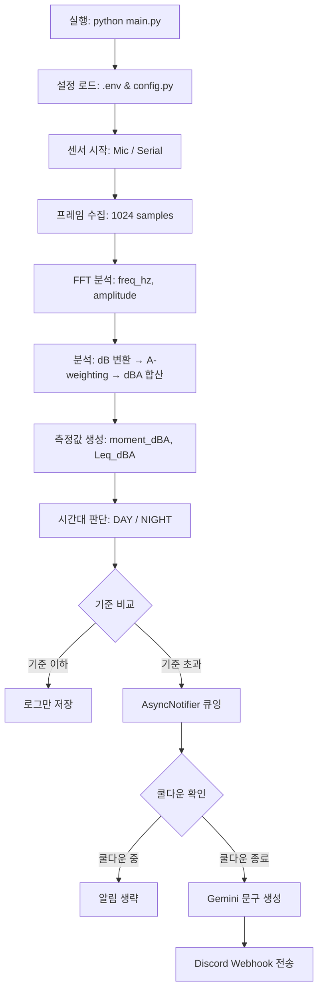

```markdown
# 🏢 층간소음 예방 알림 시스템

층간소음을 감지하고 분석하여 기준치 초과 시 알림을 보내는 스마트 모니터링 시스템입니다.

## 🚀 실행 방법

```bash
python main.py air      # 공기전달 소음 마이크 측정
python main.py solid    # 고체전달 충격음 시리얼 센서 측정
python main.py both     # 두 센서 동시 실행
```

## 📁 폴더 구조 및 역할

```text
noise_monitor_refactor/
│
├── main.py               # 프로그램 시작점
├── .env                  # 환경변수 설정 파일
│
├── noise_monitor/
│   ├── config.py         # 모든 설정값 관리
│   ├── processer.py      # air / solid / both 실행 제어
│   │
│   ├── sensors/
│   │   ├── sound_sensor.py # 마이크 입력 처리
│   │   └── solid_sensor.py # 진동센서 시리얼 입력 처리
│   │
│   ├── core/
│   │   ├── dsp.py        # FFT 처리
│   │   ├── analyzer.py   # dB, dBA, 순간소음도 계산
│   │   ├── leq.py        # 등가소음도 Leq 계산
│   │   └── types.py      # NoiseMeasurement, ThresholdViolation 등 데이터 타입
│   │
│   ├── alert/
│   │   ├── rules.py      # 주야간 판단, 기준치 초과 판단
│   │   └── notifier.py   # Discord / Gemini / 비동기 알림 처리
│   │
│   └── utils/
│       └── plotter.py    # FFT 그래프 저장
│
└── logs/
    ├── air/
    └── solid/
```

## ⚙️ 환경변수 설정 (.env)

```bash
export DISCORD_WEBHOOK_URL="..."
export GEMINI_API_KEY="..."
export SOUND_DEVICE=0
export PLOT_ENABLED=1
```

## 🌊 전체 시스템 동작 Flow



<br>

## 🔍 상세 동작 Flow (클릭해서 펼치기)

<details>
<summary><b>🌬️ 공기 / 🧱 고체 전달 소음 동작 Flow</b></summary>
<br>

**[공기 전달 소음]**
```text
SoundNoiseMonitor.run_forever()
 ├── sounddevice RawInputStream 시작
 ├── 마이크 callback 실행
 ├── audio_queue에 raw audio 저장
 ├── 메인 루프에서 audio_queue.get()
 ├── int16 audio numpy 배열 변환
 ├── RfftProcessor.transform()
 ├── AirNoiseAnalyzer.analyze()
 ├── moment_dBA 계산
 ├── LeqCalculator.push(moment_dBA)
 ├── NoiseMeasurement 생성
 └── NoiseJudge.check() ── (기준 초과 시 AsyncNotifier.notify)
```

**[고체 전달 충격음]**
```text
SolidNoiseMonitor.run_forever()
 ├── serial.Serial 연결
 ├── 128 byte 단위로 raw 데이터 읽기
 ├── struct.unpack으로 short 값 변환
 ├── 1024개 frame_size만큼 버퍼 누적
 ├── EMA 방식으로 offset 보정
 ├── 가속도 단위 m/s² 변환
 ├── RfftProcessor.transform()
 ├── SolidNoiseAnalyzer.analyze()
 ├── moment_dBA 계산
 ├── LeqCalculator.push(moment_dBA)
 ├── NoiseMeasurement 생성
 └── NoiseJudge.check() ── (초과 시 AsyncNotifier.notify)
```
</details>

<details>
<summary><b>🔔 알림 처리 및 쿨다운 Flow</b></summary>
<br>

**[알림 처리]**
```text
기준 초과 발생 → ThresholdViolation 생성
 └── AsyncNotifier.notify()
      ├── (중복) 대기 중이면 무시
      └── (신규) queue에 넣음
           └── background alert-worker thread
                └── DiscordNotifier.notify()
                     ├── 쿨다운 중이면 전송 안 함
                     └── 쿨다운 지났으면 진행
                          ├── USE_AI_MESSAGE=1 이면 Gemini 호출
                          └── USE_AI_MESSAGE=0 이면 기본 문구 사용
                               └── Discord webhook 전송
```

**[알림 쿨다운]**
```text
알림 전송 성공 → 현재 시간 저장 → 10분 동안 같은 종류 알림 생략 → 10분 이후 다시 알림 재전송 가능
```
</details>

<details>
<summary><b>🧮 데이터 계산 및 로그 처리 Flow</b></summary>
<br>

**[FFT (고속 푸리에 변환)]**
```text
raw signal → np.fft.rfft() → 주파수 배열 freq_hz 생성 → 진폭 amplitude 계산 → 0Hz 성분 제거
```

**[dB / dBA 계산]**
```text
FFT amplitude → dB 변환 → A-weighting 적용 → 주파수별 dBA 배열 → 에너지 합산 → 순간 dBA(moment)
```

**[등가소음도(Leq) 계산]**
```text
moment_dBA → 10^(dBA/10) 에너지 변환 → 최근 N개 에너지 누적 → 평균 에너지 계산 → 10 * log10(mean_energy) → Leq_dBA
```

**[로그 저장]**
```text
print() 발생 → TimestampTee
 ├── 콘솔 출력
 └── 파일 저장 → DailyLogFile → 날짜/요일별 로그 파일 생성
```
</details>